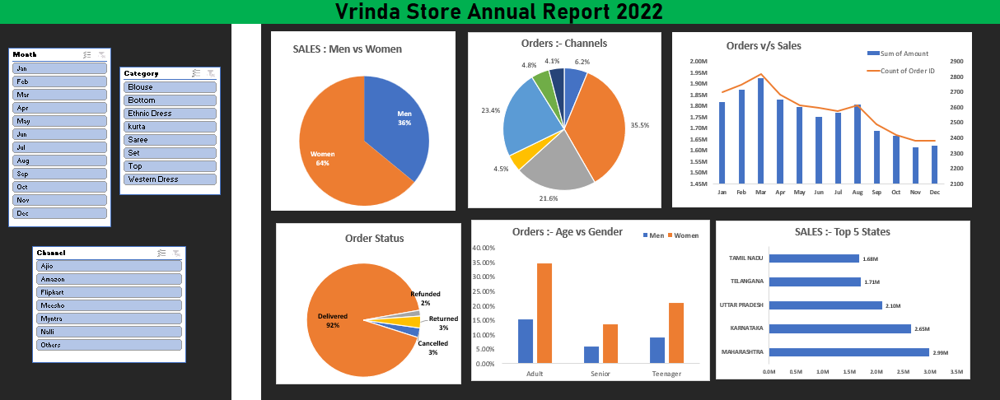

# Vrinda Store Sales Dashboard & Business Insights (2022)

---

## Dashboard Preview



>  **Note:** Rename `dashboard.png.png` → `dashboard.png` (remove the duplicate extension) for consistent rendering across all platforms.

---

## Overview

An interactive Excel dashboard analyzing 2022 retail sales data from Vrinda Store — a fashion e-commerce brand. The project transforms raw transactional data into actionable business insights covering customer demographics, regional performance, channel contribution, and monthly sales trends using Pivot Tables, Pivot Charts, and dynamic slicers.

---

## Business Questions Answered

| # | Question | Answer |
|---|----------|--------|
| 1 | Which months have the highest sales? | March and April — peak sales months in 2022 |
| 2 | Which customer segment contributes the most revenue? | Women aged 30–49 years drive the majority of purchases |
| 3 | Which states generate the most orders? | Maharashtra, Karnataka, and Uttar Pradesh are the top 3 states |
| 4 | Which sales channels perform best? | Amazon and Flipkart are the top-performing channels |
| 5 | Which product categories drive the most sales? | Sarees, Kurtas, and Western Dress lead in order volume |

---

## Dataset

 **File:** `Vrinda_Store_Data_Analysis_.xlsx`

| Column | Description |
|--------|-------------|
| Order ID | Unique order identifier |
| Customer ID | Unique customer identifier |
| Gender | Male / Female |
| Age | Customer age |
| Age Group | Teenager / Adult / Senior |
| Date | Order date |
| Month | Month of the order |
| Status | Delivered / Returned / Cancelled / Refunded |
| Channel | Amazon / Flipkart / Myntra / Meesho / Ajio / Others |
| Category | Product category (Saree, Kurta, Western Dress, etc.) |
| Amount | Order value in INR |
| Ship State | Delivery state |
| B2B | Whether order is business-to-business |

---

## KPI Summary

| Metric | Formula |
|--------|---------|
| Total Sales | SUM of Amount column |
| Total Orders | COUNT of Order IDs |
| Average Order Value | Total Sales ÷ Total Orders |

> Full KPI reference available in the `KPI SUMMARY` file. Detailed written analysis available in `Vrinda.docx`.

---

## Methodology

### Data Cleaning
- Removed duplicate and null records
- Standardized inconsistent values in Gender column (e.g., "M" → "Men", "W" → "Women")
- Converted Age to Age Group buckets (Teenager / Adult / Senior)
- Verified Order Status categories for consistency

### Data Analysis
- Built Pivot Tables to summarize sales by month, channel, state, gender, and category
- Calculated order status distribution (Delivered vs. Returned vs. Cancelled)
- Performed age-gender cross-analysis to identify the highest-value customer segment

### Dashboard Creation
- Combined all Pivot Charts into a single interactive dashboard sheet
- Added slicers for dynamic filtering across all visuals simultaneously

---

## Dashboard Features

**Interactive Slicers:**
- Month
- Sales Channel (Amazon, Flipkart, Myntra, Meesho, Ajio)
- Product Category

**Visualizations Included:**

| Chart | Type | Insight |
|-------|------|---------|
| Monthly Sales & Orders Trend | Combo Bar + Line | Peak months identified |
| Sales by Gender | Pie Chart | Women dominate purchases |
| Order Status Distribution | Pie Chart | Delivery vs. return rates |
| Top 5 States by Sales | Bar Chart | Regional performance |
| Sales by Age Group & Gender | Grouped Bar | Highest-value segment |
| Sales by Channel | Pie Chart | Amazon & Flipkart lead |

---

## Key Insights

**Sales Trends**
- **March and April** recorded the highest sales and order volumes in 2022
- Sales decline steadily after April through the second half of the year

**Customer Demographics**
- **Women** account for the majority (~64%) of total purchases
- The **Adult (30–49 years)** age group is the top-spending segment
- **Women aged 30–49** are the single most valuable customer segment — primary target for marketing

**Regional Performance**
- **Maharashtra, Karnataka, and Uttar Pradesh** are the top 3 revenue-generating states
- These 3 states together contribute approximately 35% of total orders

**Channel Performance**
- **Amazon** and **Flipkart** are the highest-performing channels by order volume
- Myntra, Meesho, and Ajio contribute a smaller but notable share

**Order Status**
- Majority of orders are successfully **Delivered**
- Returns and cancellations are a minority but highlight categories with quality or sizing issues

---

## Recommendations

Based on the analysis, the following actions are recommended to maximize Vrinda Store's 2023 revenue:

1. **Target women aged 30–49** in Maharashtra, Karnataka, and Uttar Pradesh through Amazon and Flipkart ads
2. **Increase ad spend in March–April** — peak season promotions will have the highest ROI
3. **Reduce returns** by improving size guides and product descriptions in high-return categories
4. **Expand Meesho and Ajio presence** — growing platforms with lower competition than Amazon/Flipkart

---

## Project Structure

```
├── Vrinda_Store_Data_Analysis_.xlsx    # Main Excel file — data + Pivot Tables + dashboard
├── dashboard.png.png                   # Dashboard screenshot (rename to dashboard.png)
├── KPI SUMMARY                         # KPI metric formulas reference
├── Vrinda.docx                         # Full written analysis report
└── README.md                           # Project documentation
```

---

## How to Open

```
1. Download Vrinda_Store_Data_Analysis_.xlsx
2. Open in Microsoft Excel (2016 or later recommended)
3. Enable editing if prompted
4. Navigate to the Dashboard sheet
5. Use the slicers to filter by Month, Channel, or Category
6. Read Vrinda.docx for the full written analysis and recommendations
```

---

## Tools & Technologies

| Tool | Purpose |
|------|---------|
| Microsoft Excel | Data cleaning, Pivot Tables, dashboard design |
| Pivot Tables | Dynamic data aggregation and summarization |
| Pivot Charts | Interactive visualizations linked to slicers |
| Slicers | One-click filtering across all dashboard charts |
| Conditional Formatting | Highlighting key values and trends |

---

## Business Impact

- Identifies the **highest-value customer segment** (women, 30–49, top 3 states) for targeted campaigns
- Pinpoints **peak sales months** for budget and inventory planning
- Reveals **top-performing channels** to optimize marketing spend allocation
- Quantifies **return rates** to support product quality improvement decisions
- Delivers a complete annual sales review to support 2023 strategy planning

---

## Author
Ramu Battu
**Ramu Battu**
MS in Data Analytics — California State University, Fresno
📧 ramuusa61@gmail.com
